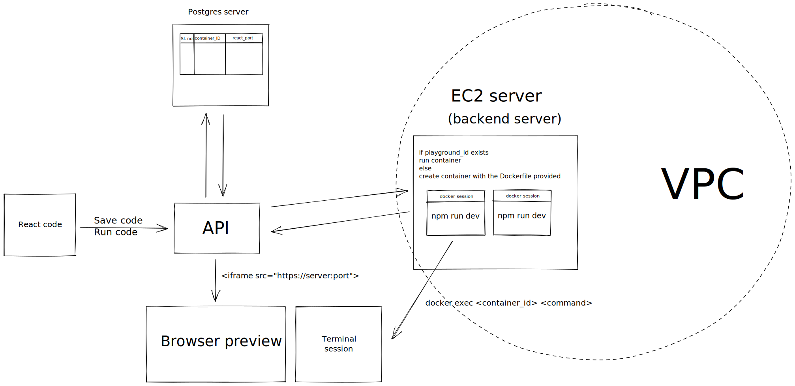

# coding-playground-backend

# Setting it up locally 

### Starting the server
```bash
yarn 
yarn start
# OR 
npm install 
npm start
```

### Running prisma
```bash
npx prisma studio
```

# How I've implemented this


### Working with docker
- This app uses `node-docker-api` for stopping, deleting and checking if the container already exists and the official docker engine API to create and start containers
- The API request has to be made via the unix socket to the `/var/run/docker.sock` on the host machine

### Containerizing each user session
- Every user would have their own docker container running on which their react application would run
- Port 3000 is mapped to an available port on the backend server randomly which will then be used as the source for the iframe to display browser preview in the playground

### Access to terminal
- Instead of giving complete access to terminal, the user is able to execute bash commands through `docker exec` inside their container

### Container information
- The id and mapped ports of running/stopped containers are stored in a Postgres database deployed on heroku
